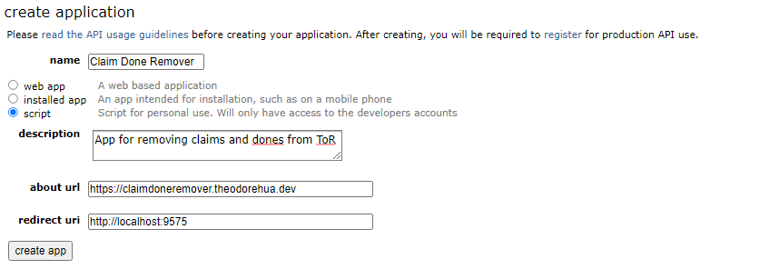
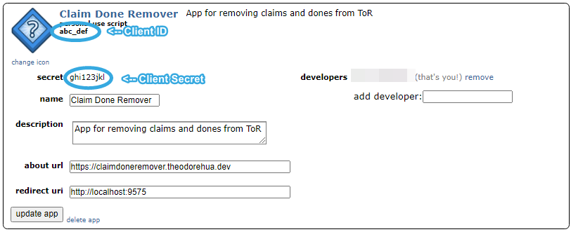

Setup
======

Creating a Reddit App
-----------------------

Navigate to `the reddit application settings page <https://www.reddit.com/prefs/apps/>`__ then scroll down and click
`create another app...` under the `developed applications` section.

Fill in the form with the following values (while most of them doesn't matter, I figured it'd be easier to provide you
everything rather than confuse you with what you have to put where.

.. list-table::
   :header-rows: 1

   * - Field Name
     - Value
   * - Name
     - Claim Done Remover
   * - [Radio Buttons]
     - Script
   * - Description
     - App for removing claims and dones from ToR
   * - about url
     - https://claimdoneremover.theodorehua.dev
   * - redirect uri
     - http://localhost:9575

Once you've filled everything in, the box should look something like this:

After you've double checked the values, click `create app`. After a few seconds a new box should pop up under the
`developed apps` section, you're going to need the client ID and client secret (ID is located under the words
`personal use script` and secret is located next to the word `secret`). See the circled locations in the example image:

You're going to want to keep those values in mind as you're going to need them later on.

Open the Application
---------------------

In the folder where you installed CDR, run the application named `ClaimDoneRemover.pyw`, it may take a few seconds to
load up, don't worry if it says error.

After it loads, you should click the `Options` button followed by `Edit Config`. Fill in `User` with your reddit
username (do not include `/u/`, for example, if my reddit username is `/u/TheodoreHua` then I would fill in
`TheodoreHua`). You can leave the other values as is for now as they'll work (you can change them later on).

Now click submit, there's going to be a popup stating that you need to restart the application to put the changes into
effect, click ok and don't restart the program. Now you should click the button in the options menu named
`Edit PRAW Config`. Fill in the `Client ID` and `Client Secret` fields with the values you got in
:ref:`the reddit setup section<Creating a Reddit App>` then click the `Generate` button next to the `Refresh Token`
field. A page should open up in your webbrowser, login to reddit (if you haven't already), then click allow.
Hopefully the browser now says `Success`, if it does and you see that the Refresh Token field is now filled in, great
you can proceed to the next step, if not, try it again and if it still doesn't work then contact me.

.. note:: It's normal for the CDR windows to not be responding while you follow the reddit flow in your browser, this is
    normal behaviour. Please do not close the program if Windows prompts you to do so. There's currently nothing I can
    do to avoid this as I can't process window updates while waiting for the Reddit request.

You should now restart CDR, you can do so by clicking the `Restart CDR` button in the options menu or clicking the `X`
and opening the file again (the former is easier).

All Setup!
-----------

That's it! If you did everything properly, CDR should now be configured and ready for use. You will see an output
after a few seconds. Each comment older than your cutoff or has a bot reply (depending on the config) should be deleted.
You can then either leave the program running in the background to delete posts while you are transcribing as it gets
triggered, or you can manually run it now and then in order to delete comments in batches. If you persistently see that
a comment is "Awaiting Trigger", you may chose to override the trigger and delete it regardless of whether the bot
responded or reached cutoff using the menu option.

If you'd like to edit the config options (or see what they do), you should go to
`the config options page <config-options.html>`_ and `the modes page <modes.html>`_.
If you have any questions at all, feel free to contact me at contact@theodorehua.dev.
You can also check the `FAQ <faq.html>`_ first to see if your question has already been answered.
